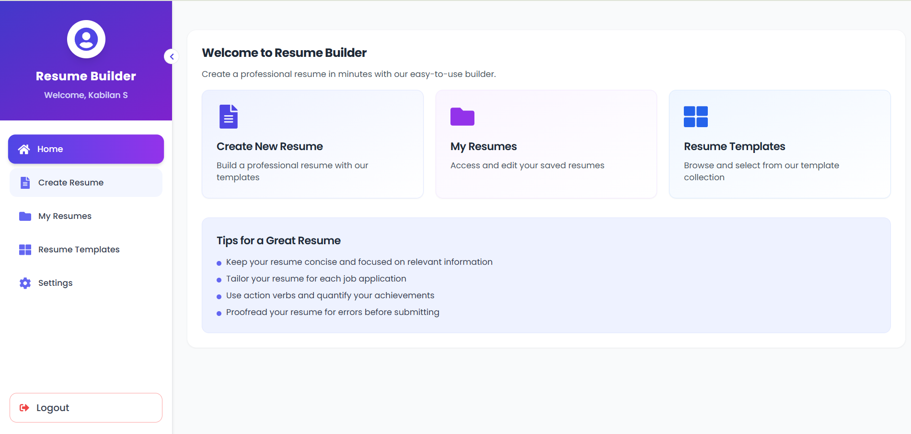
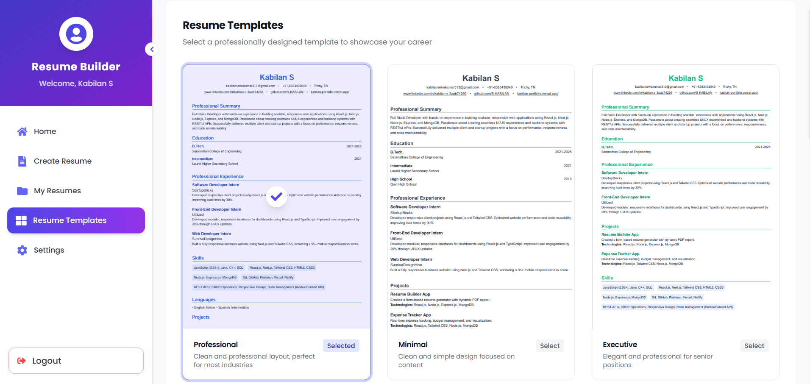
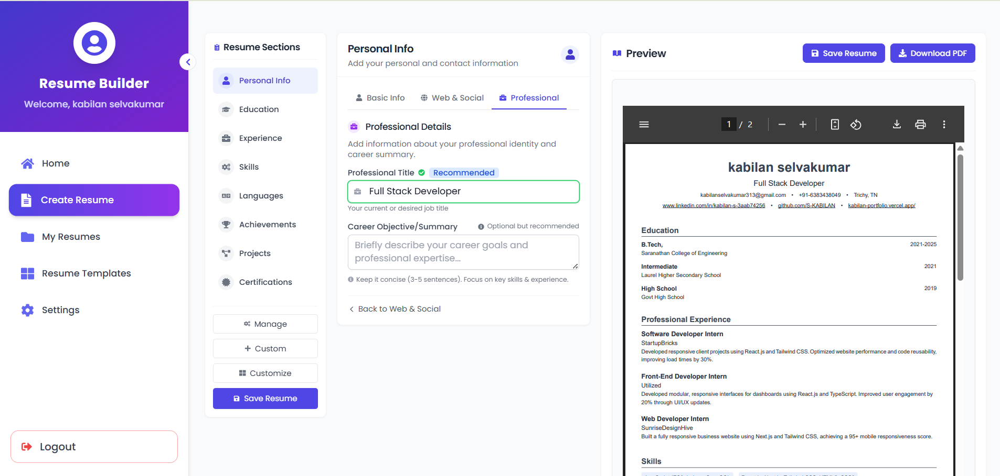
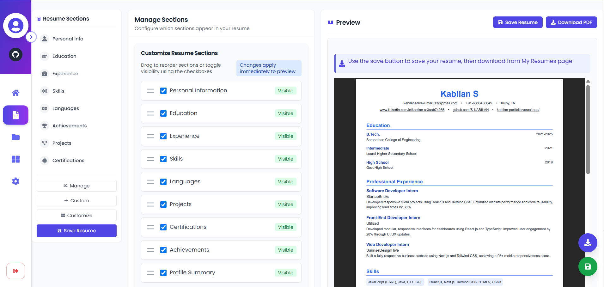
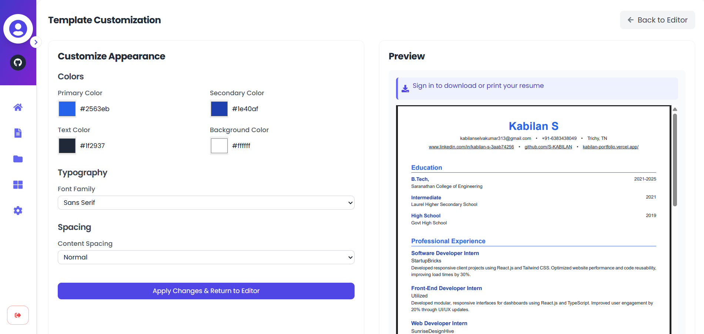
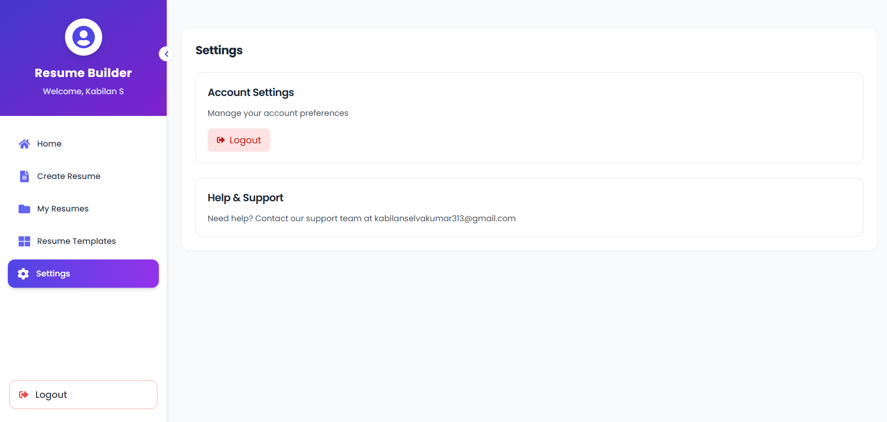

# Resume Builder

<div align="center">
  
</div>

## 📑 Overview

Resume Builder is a comprehensive web application designed to simplify the resume creation process. With a modern UI, multiple template designs, and intuitive customization options, users can create professional, ATS-friendly resumes in minutes. The application supports both Google Authentication and traditional email/password registration.

## ✨ Features

- **User Authentication**

  - Google Authentication
  - Email/Password Registration
  - Secure Login System

- **Resume Creation**

  - Intuitive Form-Based Interface
  - Multiple Resume Sections
  - Real-Time Preview

- **Template Selection**

  - Multiple Professional Templates
  - ATS-Friendly Designs
  - Modern & Traditional Layouts

- **Advanced Customization**

  - Section Arrangement
  - Font Size Adjustment
  - Content Spacing Options
  - Section Visibility Control

- **Resume Management**

  - Save Multiple Resumes
  - Edit Existing Resumes
  - Delete Unwanted Resumes

- **Export Options**

  - Download as PDF
  - High-Quality Print Format

- **Responsive Design**
  - Desktop & Laptop Friendly
  - Tablet Compatible
  - Mobile Navigation with Bottom Bar

## 📱 Screenshots

### Resume Templates



### Create Resume



### Section Rearrangement



### Template Customization



### Settings



## 🚀 Tech Stack

### Frontend

- **React.js** - UI component library
- **Tailwind CSS** - Utility-first CSS framework
- **React Router** - Navigation and routing
- **React PDF** - PDF generation and preview
- **React Icons** - Icon integration

### Backend

- **Node.js** - JavaScript runtime
- **Express** - Web framework
- **MongoDB** - NoSQL database
- **JWT** - Authentication
- **Mongoose** - MongoDB object modeling

### Authentication

- **Google OAuth** - Google authentication
- **bcrypt.js** - Password hashing
- **JSON Web Tokens** - Secure user sessions

### Deployment

- **Vercel** - Frontend hosting
- **MongoDB Atlas** - Cloud database

## 💻 Installation and Setup

### Prerequisites

- Node.js (v14.0 or higher)
- npm or yarn
- MongoDB (local or Atlas connection)

### Frontend Setup

```bash
# Clone the repository
git clone https://github.com/yourusername/resume-builder.git

# Navigate to frontend directory
cd resume-builder/frontend

# Install dependencies
npm install

# Create .env file for environment variables
touch .env

# Add the following variables to .env
VITE_API_BASE_URL=http://localhost:5000
VITE_GOOGLE_CLIENT_ID=your_google_client_id

# Start the development server
npm run dev
```

### Backend Setup

```bash
# Navigate to backend directory
cd ../backend

# Install dependencies
npm install

# Create .env file for environment variables
touch .env

# Add the following variables to .env
PORT=5000
MONGODB_URI=your_mongodb_connection_string
JWT_SECRET=your_jwt_secret
GOOGLE_CLIENT_ID=your_google_client_id

# Start the development server
npm run dev
```

## 🔧 Configuration

### Google OAuth Setup

1. Go to the [Google Developer Console](https://console.developers.google.com/)
2. Create a new project
3. Enable the Google OAuth API
4. Create OAuth 2.0 credentials
5. Add authorized JavaScript origins and redirect URIs
6. Copy the Client ID and use it in your environment variables

### MongoDB Setup

1. Create a [MongoDB Atlas](https://www.mongodb.com/cloud/atlas) account or use a local MongoDB instance
2. Create a new cluster
3. Get your connection string
4. Add it to your backend environment variables

## 📝 Usage

1. **Register/Login**: Create an account or sign in with Google
2. **Create Resume**: Fill in your details in the form-based interface
3. **Choose Template**: Select from multiple professional templates
4. **Customize**: Arrange sections, adjust spacing, and control visibility
5. **Save & Download**: Save your work and download as a PDF

## 👥 Contributing

Contributions are welcome! Please feel free to submit a Pull Request.

1. Fork the repository
2. Create your feature branch (`git checkout -b feature/amazing-feature`)
3. Commit your changes (`git commit -m 'Add some amazing feature'`)
4. Push to the branch (`git push origin feature/amazing-feature`)
5. Open a Pull Request

## 📄 License

This project is licensed under the MIT License - see the LICENSE file for details.

## 🙏 Acknowledgements

- [React.js](https://reactjs.org/)
- [Node.js](https://nodejs.org/)
- [Tailwind CSS](https://tailwindcss.com/)
- [MongoDB](https://www.mongodb.com/)
- [Vercel](https://vercel.com/)

## 📧 Contact

Kabilan S - kabilanselvakumar313@gmail.com

Project Link: [https://github.com/S-KABILAN/resume-builder](https://github.com/S-KABILAN/resume-builder)
